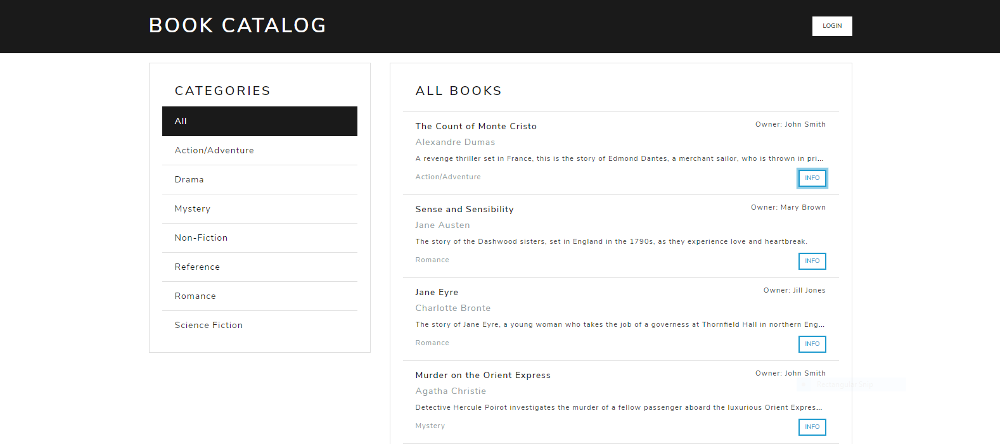
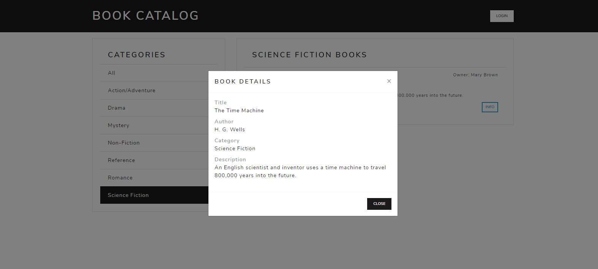
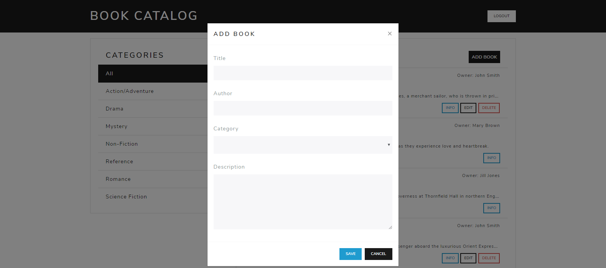
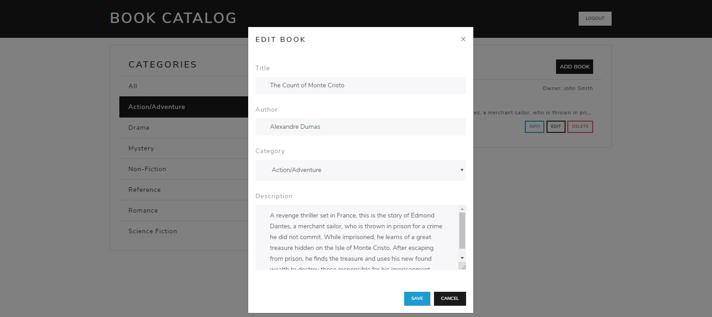
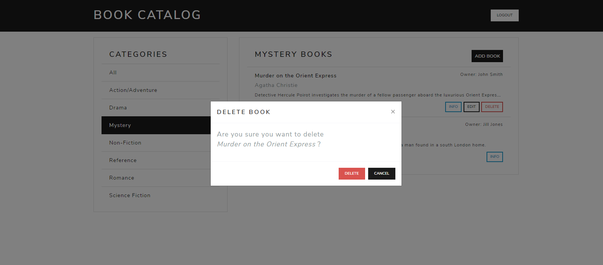

# Book Catalog Web App

This web application was developed using the Python Flask framework, and uses Google's authentication services for sign-in. It can be used to track information on books, including title, author, description and category.

## Screenshots

Before logging in, users can see all books in the catalog, filter by category and view book details.





After logging in, users can add new books to the catalog, and can edit & delete books that they own (but cannot change books with other owners). 








## Setup and Configuration

To run the catalog application, it is recommended that you first set up the Ubuntu virtual machine (VM) that comes preloaded with Python, the PostgreSQL database and other supporting software. The following sections provide information on setting up the VM, adding items to the catalog database and launching the application.

#### Prerequisites

To set up the VM, you will need both Vagrant and VirtualBox. If you do not have these currently installed, they can be obtained from:

- [the vagrantup.com download page](https://www.vagrantup.com/downloads.html)
- [the virtualbox.org download page](https://www.virtualbox.org/wiki/Downloads) 

#### Setting up the virtual machine

Fork and clone the following Github repository:

<https://github.com/udacity/fullstack-nanodegree-vm>

From the command prompt, `cd` into the `fullstack-nanodegree-vm/vagrant` directory, and run the following to create and configure the VM:
```sh
$ vagrant up
```
Note: this command may take some time to run.

Next, establish an SSH session with the VM:
```sh
$ vagrant ssh
```

#### Adding the catalog application to the virtual machine

Download or clone this repository, and add the contents to the `vagrant` directory which is shared with the VM.


#### Obtaining OAuth credentials from Google

The web application requires a file `client_secrets.json` with a client ID and secret from Google. This can be obtained using the following steps:
1. Navigate to: https://console.developers.google.com/projectselector/apis/credentials
2. Select the option to Create a project
3. Set the Project name to Book Catalog and click Create
4. From the navigation menu, select APIs and Services -> Credentials
5. Select the option to Create credentials -> OAuth client ID
6. Click "Configure consent screen"
7. Set the Application name to Book Catalog and click Save
8. Set the Application type to Web application and click Create
9. Specify the Authorized JavaScript origins as: http://localhost:5000
10. Specify two Authorized redirect URIs: http://localhost:5000/login http://localhost:5000/gconnect
11. Click Create
12. Once the OAuth client ID has been created, select the option to download it as a JSON file
13. Rename the file to `client_secrets.json` and add it to the `vagrant` folder that is shared with the VM


#### Adding categories and books to the database

The `add_books.py` script should be run before launching the catalog application. This script will add a series of categories to the database (including Action/Adventure, Mystery and Science Fiction). It will also create some sample users and books. If you would like to create any additional categories, this can be done by modifying the python script.  

From the command prompt (while still in the SSH session from above), run the following to set up and add items to the database:

```sh
$ cd /vagrant
$ python add_books.py
```

After running the script, you should see a `catalog.db` file in the `/vagrant` directory.

#### Launching and accessing the application

The catalog application can be launched by running the `app.py` script:

```sh
$ python app.py
```

The application can then be accessed at <http://localhost:5000> from your favorite browser.

## API Endpoints

Several endpoints are available to extract information from the database in json format.

Book categories:
<http://localhost:5000/categories/json>

Information on all books in a category:
<http://localhost:5000/category/&lt;category_id&gt;/json>

Information on a book:
<http://localhost:5000/book/&lt;book_id&gt;/json>


